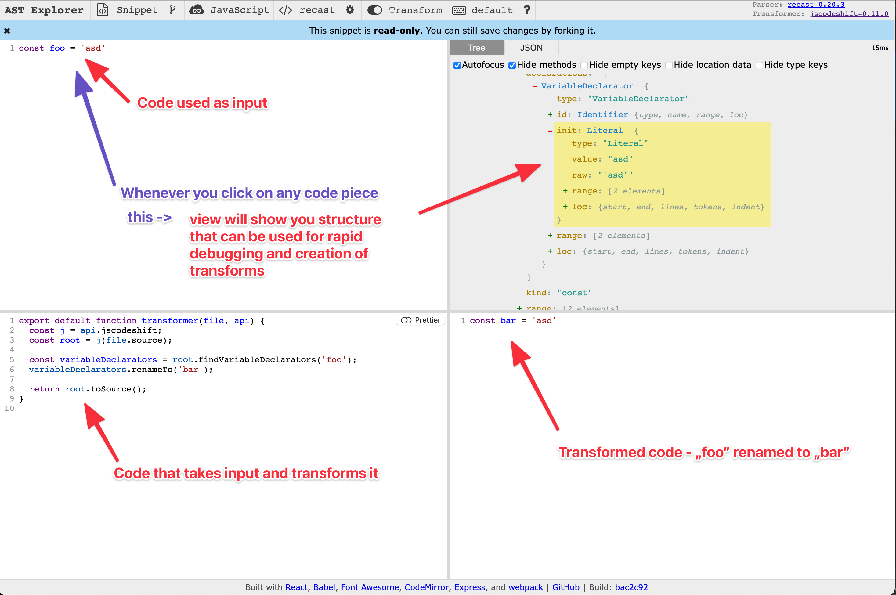

# jscodeshift

This repository contains JSCodeShift templates that can be used for mass migration or verification in JS/TS.

For example, you can transform code like that:
```js
// --- Input code
try {} catch {}

// --- Output code
try {}
catch (e) {
  // ⚠️ Added missing catch param identifier
  // ⚠️ Added missing throw
  throw e
}
```

## Installation

```shell
yarn install
```

## Run codemod
This run will change files and save them.
```shell
yarn run jscodeshift \
  -t transforms/try-catch.ts \
  ./../packhelp/landing/**/*.ts \
  --extensions=ts \
  --parser=ts \
  --ignore-pattern=./../**/node_modules/** \
  --print
```
> _Omit `--print` to avoid terminal spam._
> _Omit `--dry` to write the transformed source back to disk._


### Debug dry run:
This run only prints changes to terminal.
```shell
yarn run jscodeshift \
  -t transforms/try-catch.ts \
  ./../packhelp/landing/**/*.ts \
  --extensions=ts \
  --parser=ts \
  --ignore-pattern=./../**/node_modules/** \
  --print \
  --dry
```


## How to speed up templates creation

Use `@babel/parser` in [https://astexplorer.net](https://astexplorer.net) when working with the jscodeshift's [default parser](https://github.com/facebook/jscodeshift#usage-cli) (default: `babel`).



--------------

## Test
```shell
yarn test
```

## Debug

Use the [pre-configured VSCode launcher](.vscode/launch.json) to run tests and debug your transformer.


## Resources & Inspiration

- https://github.com/facebook/jscodeshift/tree/master/sample
- https://github.com/facebook/jscodeshift/blob/master/recipes/retain-first-comment.md
- https://github.com/elliottsj/jscodeshift-typescript-example
- https://astexplorer.net

## TypeScript all the way 🚀

Example usage of [jscodeshift](https://github.com/facebook/jscodeshift) _for_ TypeScript _with_ TypeScript:

- TypeScript target files *.ts
- TypeScript transformer
- TypeScript test files
- TypeScript fixtures

## TypeScript transformer

Strongly typed code and code completion with `@types/jscodeshift`


