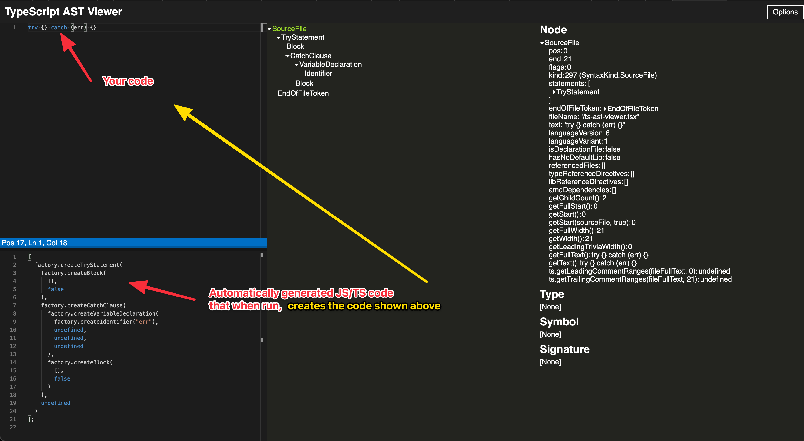

# jscodeshift

This repository contains JSCodeShift templates that can be used for mass migration or verification in JS/TS.

For example, you can transform code like that:
```js
// --- Input code
try {} catch {}

// --- Output code
try {}
catch (e) {
  // ⚠️ Added missing catch param identifier
  // ⚠️ Added missing throw
  throw e
}
```

Not impressed? Understandable :) but don't quit yet, and check for example this one ([create tests to implemented code](transforms/__docs__/create-jest-tests.md))

## Installation

```shell
yarn install
```

## Creating new transform/migration
This helper command will:
- Create new migration/transform file with given name
- Add docs
- Add tests
- Add test input and output files

Replace `new-migration-script-name` with for example `reverse-params`

```shell
yarn make new-migration-script-name
```

## Run codemod
This run will change files and save them.
```shell
yarn run jscodeshift \
  -t transforms/try-catch.ts \
  ./../packhelp/landing/**/*.ts \
  --extensions=ts \
  --parser=ts \
  --ignore-pattern=./../**/node_modules/** \
  --print
```
> _Omit `--print` to avoid terminal spam._
> _Omit `--dry` to write the transformed source back to disk._


### Debug dry run:
This run only prints changes to terminal.
```shell
yarn run jscodeshift \
  -t transforms/try-catch.ts \
  ./../packhelp/landing/**/*.ts \
  --extensions=ts \
  --parser=ts \
  --ignore-pattern=./../**/node_modules/** \
  --print \
  --dry
```


## How to speed up templates creation
You can use tools mentioned below to generate code that will drastically speed up your learning curve, or even allow you to create code modification scripts without learning anything.

[https://ts-ast-viewer.com/](https://ts-ast-viewer.com/)




[https://astexplorer.net](https://astexplorer.net)

> Use `@babel/parser` in [https://astexplorer.net](https://astexplorer.net) when working with the jscodeshift's [default parser](https://github.com/facebook/jscodeshift#usage-cli) (default: `babel`).


--------------

## Test
```shell
yarn test
```

## Debug

Use the [pre-configured VSCode launcher](.vscode/launch.json) to run tests and debug your transformer.


## Read & learn more

- https://github.com/sejoker/awesome-jscodeshift
- https://github.com/rajasegar/awesome-codemods
- https://www.raymondluong.com/blog/refactoring-javascript-with-codemods/
- https://github.com/civicsource/codemod
- https://github.com/shopify-graveyard/shopify-codemod
- https://github.com/albinekb/co-to-async
- https://github.com/jurassix/refactoring-codemods
- https://github.com/vivek12345/async-await-codemod

## Resources & Inspiration

- https://astexplorer.net
- https://github.com/facebook/jscodeshift/tree/master/sample
- https://github.com/facebook/jscodeshift/blob/master/recipes/retain-first-comment.md
- https://github.com/elliottsj/jscodeshift-typescript-example

## TypeScript all the way 🚀

Example usage of [jscodeshift](https://github.com/facebook/jscodeshift) _for_ TypeScript _with_ TypeScript:

- TypeScript target files *.ts
- TypeScript transformer
- TypeScript test files
- TypeScript fixtures

## TypeScript transformer

Strongly typed code and code completion with `@types/jscodeshift`


